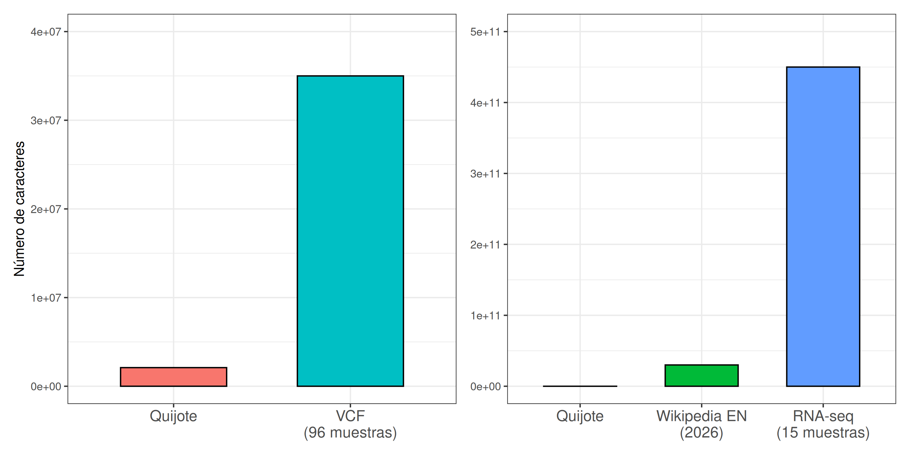

## La pregunta ya no es solo biológica

La biología sigue empezando con preguntas biológicas:

- ¿Qué especies están sufriendo cambios de rango de distribución debido al cambio global?
- ¿Qué genes se expresan en una condición experimental?
- ¿Qué variantes distinguen dos poblaciones?
- ¿Cómo cambia una comunidad microbiana entre muestras?
- ¿Qué regiones del genoma están metiladas?

Pero, en muchos proyectos actuales, responder estas preguntas exige trabajar con una cantidad de datos que requieren del uso de herrmientas informáticas.

{width=70%}

Necesitamos maneras automatizadas para:

- Leer miles o millones de registros.
- Seleccionar y filtrar datos.
- Contar, resumir y calcular estadísticas.
- Comparar muestras, poblaciones o tratamientos.
- Registrar exactamente qué pasos se han aplicado.


## ¿Qué aporta la informática?

La informática no decide por ti la hipótesis, el diseño experimental o la
interpretación biológica. Sí permite aplicar un procedimiento definido muchas veces,
rápido y con menos errores manuales.

| Tarea | A mano | Con comandos o un script |
|---|---|---|
| Contar observaciones por especie | Posible con pocas filas | Rápido con miles o millones de filas |
| Seleccionar lecturas largas | Imposible a escala real | Un criterio aplicado a todas las lecturas |
| Comparar muestras | Difícil de repetir exactamente | Repetible y documentable |
| Corregir un criterio de filtrado | Hay que repetir pasos manuales | Se cambia una instrucción y se vuelve a ejecutar |
| Explicar qué se hizo | Depende de notas y memoria | El código conserva el procedimiento |

La idea central del curso es la siguiente:

> Si puedes expresar una tarea como una secuencia clara de instrucciones, puedes
> pedir al ordenador que la ejecute sobre todos los datos.

Durante el curso aprenderás dos formas complementarias de hacerlo:

- **Línea de comandos:** instrucciones breves para inspeccionar, buscar, filtrar,
  combinar y transformar archivos.
- **Python:** programas más flexibles para automatizar análisis y crear resultados
  a partir de datos.

## Sistemas abiertos: por qué importan

En este curso utilizaremos herramientas abiertas o basadas en estándares abiertos:
Linux, `bash`, Python y formatos de texto habituales en biología.

Un sistema abierto no significa necesariamente que todo sea gratuito o que cualquier
dato deba ser público. Significa, sobre todo, que las reglas de funcionamiento y los
formatos son accesibles, documentados y utilizables por distintas personas y
programas.

Esto tiene ventajas prácticas importantes.

- **Transparencia.** Puedes inspeccionar qué contiene un archivo y qué hacen las
  instrucciones que ejecutas.
- **Reproducibilidad.** Otra persona puede repetir el mismo análisis con los mismos
  datos y las mismas instrucciones.
- **Interoperabilidad.** Un archivo FASTA, VCF o GFF3 puede ser leído por muchas
  herramientas diferentes, no solo por el programa que lo creó.
- **Durabilidad.** Un archivo de texto documentado suele seguir siendo interpretable
  años después, incluso aunque cambie el programa original.
- **Automatización.** Los formatos bien definidos permiten conectar pasos en un
  análisis: la salida de una herramienta puede ser la entrada de otra.
- **Comunidad.** Las herramientas abiertas permiten detectar errores, compartir
  mejoras, crear tutoriales y aprovechar trabajo previo.

::: {.callout-tip title="FAIR no equivale exactamente a abierto"}

En investigación se utilizan con frecuencia los principios FAIR:

- **F — Findable:** localizable.
- **A — Accessible:** accesible mediante reglas claras.
- **I — Interoperable:** compatible con otros datos y herramientas.
- **R — Reusable:** reutilizable gracias a documentación, metadatos, procedencia y
  condiciones de uso.

Un conjunto de datos sensible, por ejemplo datos clínicos, puede no ser público y
seguir aspirando a ser FAIR: sus metadatos y condiciones de acceso pueden estar
documentados, y sus formatos pueden seguir estándares.

:::

## Archivos de texto bien hechos

Un archivo de texto es un archivo que contiene caracteres legibles: letras, números,
tabuladores, comas y saltos de línea. Se puede abrir con un editor de texto, pero su
mayor ventaja es que también puede ser leído por programas.

No basta con que un archivo se vea ordenado. Para que sea fácil de analizar debe tener
una estructura clara y consistente.

### Características esenciales

Un buen archivo de texto para análisis suele cumplir estas reglas:

1. **Una observación o registro por línea**, cuando el formato lo permite.
2. **Una estructura repetida y predecible.** Todas las filas de una tabla tienen las
   mismas columnas; todos los registros FASTQ tienen cuatro líneas.
3. **Separadores claros y constantes.** Comas, tabuladores o un formato formalmente
   definido.
4. **Cabeceras informativas.** Los nombres de las columnas explican qué representa
   cada valor.
5. **Identificadores únicos y estables.** Por ejemplo, `sample_id`, `read_id` o
   `gene_id`.
6. **Datos atómicos.** Una celda o campo debe contener una sola clase de información.
7. **Valores ausentes definidos.** Por ejemplo, usar `NA` o un campo vacío de manera
   consistente, no una mezcla de `-`, `?`, `sin dato` y celdas vacías.
8. **Unidades y convenciones explícitas.** Por ejemplo, `temperature_C` en lugar de
   `temperatura`, o `latitude_decimal_degrees` en lugar de `latitud`.
9. **Codificación de caracteres conocida.** Preferiblemente UTF-8.
10. **Sin formato visual oculto.** Un archivo de texto no depende de negritas,
    colores, celdas combinadas o fórmulas invisibles.
11. **Metadatos y documentación.** Debe ser posible saber quién generó el archivo,
    qué representa cada campo y con qué procedimiento se obtuvieron los datos.

### Un ejemplo problemático

Este archivo puede parecer útil para una persona:

```text
Muestra;Lugar;Fecha;Temperatura;Observaciones
1;Albufera;12/5;22,5;muchos individuos
dos;albufera;12 mayo 2024;caluroso;-
M-03;P.N. Albufera;;23 C;No se tomó medida de abundancia
```

Pero es difícil de analizar automáticamente:

- La fecha tiene varios formatos.
- La muestra se identifica de formas distintas.
- La temperatura contiene números, texto, comas decimales y unidades mezcladas.
- Los valores ausentes se indican de varias maneras.
- El separador es `;`, pero no se declara ni se documenta.
- No sabemos qué significa “muchos individuos”.

Una versión más útil sería:

```text
sample_id	site	sampling_date	temperature_C	individual_count	notes
S001	Albufera	2024-05-12	22.5	35	abundancia estimada visualmente
S002	Albufera	2024-05-12	NA	NA	sin medición de temperatura ni abundancia
S003	Albufera	2024-05-12	23.0	NA	sin medición de abundancia
```

Aquí:

- Todas las fechas usan el formato ISO `AAAA-MM-DD`.
- La temperatura se expresa siempre en grados Celsius y solo contiene números.
- Los datos ausentes se representan siempre con `NA`.
- Cada columna contiene un único tipo de dato.
- Las unidades aparecen en el nombre de la columna.
- Las columnas están separadas por tabuladores.

::: {.callout-important title="Regla práctica"}

Diseña tus archivos para que los pueda entender una persona que no estaba en el
proyecto —incluida tu versión de dentro de seis meses— y para que un programa pueda
leerlos sin adivinar nada.

:::

## Formatos estándar en biología

En vez de inventar un formato propio para cada proyecto, la biología usa formatos
estandarizados. Cada formato describe una clase concreta de datos y tiene reglas que
las herramientas pueden reconocer.

| Formato | Contenido habitual | Pista visual | Ejemplo de uso |
|---|---|---|---|
| CSV o TSV | Tablas | Cabecera y columnas separadas por comas o tabuladores | Datos de campo, metadatos de muestras, resultados |
| FASTA | Secuencias de ADN, ARN o proteína | Cabecera que empieza por `>` | Secuencia de un gen o genoma de referencia |
| FASTQ | Lecturas crudas y sus calidades | Registros de cuatro líneas; primera línea empieza por `@` | Salida de un secuenciador |
| GFF3 | Anotaciones sobre una secuencia | Nueve columnas separadas por tabuladores | Genes, exones, CDS y otras regiones |
| VCF | Variantes genéticas | Cabeceras que empiezan por `##` y `#CHROM` | SNPs e indels entre muestras |
| Newick | Árboles filogenéticos | Paréntesis, comas y punto y coma final | Filogenias y dendrogramas |

### CSV y TSV: tablas de datos

CSV significa *comma-separated values*; TSV significa *tab-separated values*.
Ambos son formatos de tabla. Cada fila representa una observación y cada columna una
variable.

```text
sample_id,site,sampling_date,species,individual_count
S001,Albufera,2024-05-12,Ardea_cinerea,3
S002,Albufera,2024-05-12,Egretta_garzetta,7
S003,Pego-Oliva,2024-05-14,Ardea_cinerea,1
```

En la práctica bioinformática, TSV suele ser especialmente cómodo porque los nombres,
las anotaciones o las observaciones pueden contener comas sin romper la tabla.

### FASTA: secuencias

Un archivo FASTA contiene secuencias de ADN, ARN o proteína. Cada secuencia comienza
con una cabecera que empieza por `>`.

```text
>gene_001|Arabidopsis_thaliana|rbcL
ATGTCACCACAAACAGAGACTATCGACTGCTGCTGCTGCTGCTGCTGCTG
>gene_002|Pinus_sylvestris|rbcL
ATGACCATGATTACGCCAAGCTTGGCACTGCTGCTGCTGATGCGT
```

La cabecera funciona como identificador y puede incluir información adicional. La
secuencia puede ocupar una o varias líneas, según el archivo.

### FASTQ: lecturas y calidad

FASTQ almacena lecturas producidas por un secuenciador. Cada lectura ocupa exactamente
cuatro líneas:

```text
@read_0001
GATTACAGATTACAGATTACA
+
IIIIIIIIIIIIIIIIIIIII
```

Las cuatro líneas son:

1. Identificador de la lectura.
2. Secuencia de nucleótidos.
3. Separador, normalmente `+`.
4. Calidad de cada base, codificada mediante caracteres.

La cuarta línea tiene la misma longitud que la secuencia: cada carácter corresponde a
una base. Por eso FASTQ es más grande que FASTA, pero conserva información esencial
para evaluar la calidad de los datos.

### GFF3: anotaciones de un genoma

GFF3 se usa para indicar dónde están las regiones anotadas de una secuencia: genes,
exones, intrones, CDS, repeticiones, etc. Cada registro tiene nueve columnas separadas
por tabuladores.

```text
##gff-version 3
chr1	annotation	gene	1001	5000	.	+	.	ID=gene001;Name=RBCS1
chr1	annotation	mRNA	1001	5000	.	+	.	ID=transcript001;Parent=gene001
chr1	annotation	exon	1001	1200	.	+	.	Parent=transcript001
```

La ventaja de una estructura fija es que un programa puede saber, sin ambigüedad, qué
columna contiene el cromosoma, las coordenadas, el tipo de región o la información
adicional.

### VCF: variantes genéticas

VCF significa *Variant Call Format*. Se usa para representar variantes respecto a un
genoma de referencia.

```text
##fileformat=VCFv4.2
#CHROM	POS	ID	REF	ALT	QUAL	FILTER	INFO
chr1	14370	rs123	G	A	29	PASS	DP=14
```

En este ejemplo, en la posición 14370 del cromosoma 1, la base de referencia es `G`,
la alternativa detectada es `A`, y `DP=14` indica una profundidad de lectura de 14.

## RTFM y RTFE

En informática encontrarás herramientas nuevas continuamente. Nadie memoriza todos
los comandos, opciones y formatos. Trabajar bien no consiste en recordarlo todo:
consiste en saber localizar información fiable y comprobar lo que haces.

La frase tradicional es:

> **RTFM — Read The Fucking Manual**

En un curso y en un entorno profesional podemos traducirla de manera útil como:

> **Lee la documentación antes de adivinar.**

La documentación suele responder preguntas como:

- ¿Qué hace exactamente este programa?
- ¿Qué formato de entrada espera?
- ¿Qué columnas o campos son obligatorios?
- ¿Qué significan las opciones disponibles?
- ¿Qué archivo genera como salida?
- ¿Qué versión del programa se ha usado?
- ¿Qué limitaciones o supuestos tiene el método?

En la terminal, muchos programas ofrecen una ayuda rápida:

```bash
comando --help
```

o bien:

```bash
man comando
```

No necesitas entender todo el manual de una vez. Busca primero:

1. Qué problema resuelve la herramienta.
2. Qué archivo espera como entrada.
3. Qué salida produce.
4. Un ejemplo mínimo de uso.
5. El significado del error que aparece.

## Los mensajes de error contienen información

La segunda frase que debes recordar es:

> **RTFE — Read The Fucking Error**

Traducido de forma útil:

> **Lee el mensaje de error completo antes de probar soluciones al azar.**

Un error no es una prueba de que “no sirves para programar”. Es información sobre la
diferencia entre lo que el programa esperaba y lo que recibió.

Por ejemplo:

```text
FileNotFoundError: [Errno 2] No such file or directory: 'muestras.csv'
```

Esto no significa “Python está roto”. Significa que Python no encuentra un archivo
llamado `muestras.csv` en la ubicación desde la que se ejecutó el programa.

Comprueba, en este orden:

1. ¿Existe realmente el archivo?
2. ¿Está escrito exactamente igual, incluidas mayúsculas y minúsculas?
3. ¿Estás trabajando en el directorio correcto?
4. ¿Tiene una extensión inesperada, por ejemplo `muestras.csv.txt`?
5. ¿La ruta indicada es correcta?

Otro ejemplo:

```text
ValueError: could not convert string to float: '23 C'
```

El programa intentó convertir un texto a número, pero encontró `23 C`. El archivo
mezcla el valor numérico con su unidad. Una solución es guardar `23.0` en una columna
llamada `temperature_C`.

::: {.callout-warning title="Evita el ensayo y error sin registro"}

No copies comandos de Internet ni opciones de una IA sin saber, al menos de forma
general, qué hacen y sobre qué archivos van a actuar.

Antes de ejecutar una instrucción, pregúntate:

- ¿Qué archivo leerá?
- ¿Qué archivo modificará o creará?
- ¿Qué espero obtener?
- ¿Puedo probar primero con una copia pequeña de los datos?

:::


## Buenas prácticas: nombres que no dan problemas

Los archivos, carpetas y variables también forman parte de un análisis reproducible.
Un nombre poco claro puede hacer que ejecutes un comando sobre el archivo equivocado,
que no encuentres tus resultados semanas después o que otra persona no entienda qué
representan tus datos.

La regla principal es sencilla:

> Usa nombres simples para el ordenador y descriptivos para las personas.

### Nombres de archivos y carpetas

Para archivos y directorios, utiliza preferiblemente:

- Letras minúsculas: `muestras.csv`, no `Muestras.CSV`.
- Números cuando ayuden a ordenar o identificar: `muestra_001.fastq`.
- Guion bajo (`_`) para separar palabras: `datos_muestreo_2026.csv`.
- Una extensión coherente con el formato: `.csv`, `.tsv`, `.fasta`, `.fastq`,
  `.vcf`, `.gff3` o `.txt`.
- Fechas en formato `AAAA-MM-DD` o `AAAAMMDD`, para que se ordenen correctamente:
  `2026-09-04_muestras_albufera.tsv`.

Evita en nombres de archivos y carpetas:

- Espacios: `datos de campo.csv`.
- Acentos y caracteres especiales: `muestras_ñandú.csv`, `temperatura_máxima.csv`.
- Símbolos con significado especial en la terminal: `*`, `?`, `!`, `$`, `&`, `;`,
  `|`, `(`, `)`, `[`, `]`, `{` o comillas.
- Nombres genéricos: `datos.csv`, `final.csv`, `final_final.csv`,
  `cosas_buenas.csv`.
- Extensiones engañosas: `muestras.csv.txt` o `secuencias_finales`.

### ¿Por qué evitar espacios y acentos?

La terminal separa normalmente los argumentos mediante espacios. Por eso este nombre:

```text
datos de campo.csv
```

puede ser interpretado como tres elementos distintos: `datos`, `de` y `campo.csv`.

Es posible trabajar con espacios usando comillas:

```bash
head "datos de campo.csv"
```

Pero obligan a recordar las comillas en cada comando y aumentan la posibilidad de
errores. Es más sencillo usar desde el principio:

```text
datos_de_campo.csv
```

Los acentos, `ñ` y otros caracteres Unicode funcionan en muchos sistemas modernos,
pero pueden ocasionar problemas al mover archivos entre ordenadores, servidores,
programas o configuraciones regionales distintas. Para scripts y análisis
reproducibles, la opción más robusta es usar caracteres ASCII simples:

```text
temperatura_maxima.csv
muestras_aranas_2026.tsv
secuencias_pinus_sylvestris.fasta
```

::: {.callout-tip title="Regla práctica para nombres de archivos"}

Usa solo letras minúsculas sin acentos (`a-z`), números (`0-9`), guion bajo (`_`),
guion medio (`-`) y punto (`.`) antes de la extensión.

Por ejemplo:

```text
2026-05-12_albufera_muestras.tsv
quercus_robur_rnaseq_r1.fastq.gz
muestras_filtradas_calidad30.csv
```

:::

### Nombres informativos

Un buen nombre debería permitir responder, sin abrir el archivo, a preguntas como:

- ¿Qué contiene?
- ¿De qué experimento, muestra, especie o lugar procede?
- ¿Qué transformación se ha aplicado?
- ¿Cuándo se generó, si la fecha es relevante?
- ¿Qué versión del resultado es?

Por ejemplo:

| Poco informativo | Mejor alternativa | Qué comunica |
|---|---|---|
| `datos.csv` | `2026-05-12_albufera_aves.tsv` | Fecha, lugar, organismo y formato |
| `final.fasta` | `pinus_sylvestris_rbcl_alineado.fasta` | Especie, marcador y procesamiento |
| `archivo1.fastq` | `muestra_s003_r1.fastq.gz` | Identificador de muestra y lectura 1 |
| `resultado.txt` | `conteo_especies_por_parcela.tsv` | Contenido del resultado |
| `final_final_v2.csv` | `muestras_filtradas_calidad30.csv` | Criterio aplicado al archivo |
| `script.py` | `contar_lecturas_fastq.py` | Qué hace el programa |

No hace falta que los nombres sean interminables. Deben contener la información
mínima que permita distinguir archivos y comprender su propósito.

### Nombres de variables en Python

Una variable guarda un valor al que queremos referirnos en un programa. Igual que un
archivo, su nombre debe indicar qué representa.

```python
x = 22.5
n = 150
a = "Albufera"
```

Estas variables son válidas, pero no explican por sí mismas qué contienen. Una versión
más clara sería:

```python
temperatura_c = 22.5
numero_lecturas = 150
sitio_muestreo = "Albufera"
```

En Python utilizaremos normalmente la convención `snake_case`:

```python
numero_muestras = 24
secuencia_referencia = "ATGCGATCG"
calidad_media = 31.8
archivo_entrada = "muestras_filtradas.tsv"
```

`snake_case` significa:

- Usar letras minúsculas.
- Separar palabras con guiones bajos.
- Elegir nombres que describan el contenido, no solo el tipo de dato.

PEP 8, la guía de estilo de Python, recomienda esta convención para variables y
funciones. [@pep8]

### Evita nombres ambiguos

No uses nombres como estos salvo en ejemplos matemáticos muy breves:

```python
x = 36
a = "S001"
data = [...]
resultado = ...
```

Prefiere:

```python
profundidad_lectura = 36
identificador_muestra = "S001"
lecturas_filtradas = [...]
porcentaje_gc = ...
```

También evita utilizar `l` (ele minúscula), `O` (o mayúscula) o `I` (i mayúscula)
como nombres de variables: se parecen demasiado a `1` y `0` en algunas tipografías.

### La prueba de los seis meses

Antes de guardar un archivo o elegir una variable, hazte esta pregunta:

> ¿Entendería este nombre dentro de seis meses sin tener que abrir el archivo o leer
> todo el programa?

Si la respuesta es no, mejora el nombre antes de continuar.


## Ejercicios

### Ejercicio 1 — ¿Por qué automatizar?

Relaciona cada situación con la estrategia más razonable:

A. Revisar 20 medidas de longitud de hojas.  
B. Contar 80 millones de lecturas de un archivo FASTQ.  
C. Elegir visualmente tres fotografías representativas de una especie.  
D. Calcular el número de observaciones por especie en 50 000 registros de campo.

Opciones:

1. Revisión visual o manual.
2. Hoja de cálculo o análisis estadístico sencillo.
3. Comandos o script automatizado.

### Ejercicio 2 — Detecta los problemas

Examina esta tabla:

```text
ID,fecha,temperatura,especie,individuos
1,12/5/24,22.5,Quercus robur,3
2,2024-05-12,23 C,Q. robur,muchos
03,12 mayo,NA,Quercus_robur,-
```

Identifica al menos cuatro problemas que dificultarían su análisis automático.

### Ejercicio 3 — Mejora el archivo

Reescribe las tres filas anteriores en un formato coherente. Usa estas reglas:

- Identificadores con el patrón `S001`, `S002`, `S003`.
- Fecha con el formato `AAAA-MM-DD`.
- Temperatura como número en grados Celsius.
- Nombre científico como `Quercus_robur`.
- Un número entero para la abundancia.
- `NA` para los datos que no se conocen.

### Ejercicio 4 — Reconoce formatos

Indica el formato más probable de cada fragmento y señala la pista que te permite
identificarlo.

**Fragmento A**

```text
>seq_01
ATGCGATCGATCGATCGATCG
```

**Fragmento B**

```text
@read_01
ATGCGATCGATCG
+
IIIIIIIIIIIII
```

**Fragmento C**

```text
#CHROM	POS	ID	REF	ALT	QUAL	FILTER	INFO
chr2	451	.	C	T	60	PASS	DP=22
```

**Fragmento D**

```text
((Quercus_robur,Quercus_petraea),Fagus_sylvatica);
```

### Ejercicio 5 — Lee el error

Una estudiante ejecuta un programa y obtiene:

```text
FileNotFoundError: [Errno 2] No such file or directory: 'datos_muestreo.csv'
```

Ha comprobado que en su carpeta existe un archivo llamado:

```text
datos_muestreo.csv.txt
```

- ¿Cuál es el problema?
- ¿Qué dos soluciones posibles tiene?
- ¿Qué comando aprenderás en el siguiente módulo para listar los archivos de una
  carpeta y comprobar sus nombres?

### Ejercicio 6 — ¿Es reproducible?

Dos estudiantes procesan el mismo archivo de lecturas.

- La estudiante A abre el archivo, elimina manualmente algunas líneas que “parecen
  malas” y guarda una copia.
- El estudiante B utiliza una herramienta que filtra las lecturas con calidad inferior
  a un umbral definido y guarda el comando ejecutado.

¿Quién ha realizado un procedimiento más reproducible? Explica por qué en dos o tres
frases.

## Soluciones y pistas

### Solución 1

- A → 1 o 2, según la pregunta.
- B → 3.
- C → 1.
- D → 2 o 3; para 50 000 registros, un procedimiento automático es preferible.

La clave es distinguir entre tareas interpretativas, con pocas observaciones, y tareas
repetitivas que deben aplicarse a todos los registros.

### Solución 2

Posibles problemas:

- Fechas con formatos distintos.
- Temperatura con número, unidad mezclada y valor ausente.
- Nombre científico expresado de dos maneras distintas.
- Abundancia expresada como número, texto y símbolo.
- Identificadores inconsistentes: `1`, `2` y `03`.
- No se especifican las unidades de temperatura en el nombre de la columna.

### Solución 3

Una posible solución es:

```text
sample_id,sampling_date,temperature_C,species,individual_count
S001,2024-05-12,22.5,Quercus_robur,3
S002,2024-05-12,23.0,Quercus_robur,NA
S003,NA,NA,Quercus_robur,NA
```

Observa que no se inventa información: si la fecha o la abundancia no se conocen, se
utiliza `NA`.

### Solución 4

- A → FASTA. La cabecera empieza por `>`.
- B → FASTQ. Tiene cuatro líneas y la primera empieza por `@`.
- C → VCF. La cabecera contiene los campos `#CHROM`, `POS`, `REF` y `ALT`.
- D → Newick. Usa paréntesis para representar agrupaciones y termina en `;`.

### Solución 5

El programa busca `datos_muestreo.csv`, pero el archivo se llama realmente
`datos_muestreo.csv.txt`.

Dos soluciones posibles:

- Renombrar correctamente el archivo para que termine en `.csv`.
- Modificar el programa para que use el nombre real del archivo, aunque no es
  recomendable conservar una extensión engañosa.

En el siguiente módulo aprenderás a usar `ls` para listar los archivos de una carpeta.

### Solución 6

El procedimiento B es más reproducible. El criterio de filtrado está definido y el
comando puede guardarse, revisarse y ejecutarse de nuevo sobre los mismos datos o sobre
otros datos equivalentes. En el procedimiento A, la decisión depende de una inspección
manual difícil de reconstruir exactamente.

## Ideas clave

- La biología actual genera conjuntos de datos demasiado grandes para ser revisados
  registro a registro.
- La informática automatiza tareas repetitivas; no sustituye la pregunta ni la
  interpretación biológica.
- Los formatos de texto estructurados permiten que personas y programas entiendan los
  datos.
- Los estándares abiertos favorecen interoperabilidad, colaboración y reproducibilidad.
- Diseña los archivos de modo que no obliguen a adivinar qué contiene cada campo.
- La documentación y los mensajes de error son herramientas de trabajo: léelos antes
  de probar soluciones al azar.


## ¿Por qué la biología necesita informática?

Hace treinta años, un estudio típico de biología generaba datos que cabían en un cuaderno de laboratorio: unas pocas decenas de mediciones, revisables a mano. Hoy, tres áreas muy distintas de la biología comparten el mismo problema — generan más datos de los que una persona puede examinar uno a uno:

- **Genómica y transcriptómica**: secuenciar un solo genoma humano produce cientos de millones de fragmentos de lectura (*reads*); un experimento de expresión génica (RNA-seq) puede generar decenas de gigabytes de datos por muestra, y un estudio compara docenas de muestras a la vez.
- **Ecología de comunidades**: una red de cámaras trampa o de sensores de campo puede generar miles de observaciones al mes; un muestreo de biodiversidad con secuenciación ambiental (metabarcoding) identifica cientos de especies en una sola muestra de suelo o agua.
- **Bioinformática clínica y epidemiológica**: analizar un solo panel genético de un paciente implica comparar su secuencia contra bases de datos de millones de variantes conocidas.

En los tres casos, el "verlo directamente" deja de ser viable, y la pregunta pasa de "¿qué observo?" a "¿qué herramienta escribo para que el ordenador lo resuma, filtre o compare por mí?". Ese es el problema que aborda este curso.

## Formatos de datos comunes en biología

Distintos tipos de datos biológicos se guardan en formatos de texto con una estructura reconocible. Aprender a identificarlos a simple vista es el primer paso para saber qué herramienta usar con cada uno.

**CSV** (*comma-separated values*) — tablas de datos, una fila por observación, columnas separadas por comas. Es el formato más general, y lo usarás en varios módulos de este curso:

```
sample_id,date,site,latitude,longitude,species,count,notes
S001,2024-05-12,SiteA,40.123,-3.456,Quercus_robur,3,Adultos en borde de camino
```

**FASTA** — secuencias biológicas (ADN, ARN o proteína). Cada secuencia ocupa dos partes: una línea de cabecera que empieza por `>` con un identificador y, opcionalmente, una descripción, y una o más líneas siguientes con la secuencia:

```
>seq1|Arabidopsis_thaliana|rbcL
ATGTCACCACAAACAGAGACTATCGACTGCTGCTGCTGCTGCTGCTGCTG
```

**FASTQ** — lecturas crudas de un secuenciador (antes de cualquier análisis). Se parece a FASTA, pero cada lectura ocupa exactamente 4 líneas: identificador (empieza por `@`), secuencia, un separador (`+`), y una línea de la misma longitud con la **calidad** de cada base leída (cuánto se fía el secuenciador de haber leído bien esa posición):

```
@read1
GATTACAGATTACAGATTACA
+
IIIIIIIIIIIIIIIIIIIII
```

**VCF** (*variant call format*) — variantes genéticas encontradas al comparar una secuencia contra un genoma de referencia (p. ej. mutaciones puntuales). Cada línea es una posición del genoma con la base de referencia, la base alternativa encontrada, y metadatos de confianza:

```
##fileformat=VCFv4.2
#CHROM  POS    ID     REF  ALT  QUAL  FILTER  INFO
1       14370  rs123  G    A    29    PASS    DP=14
```

Un archivo FASTQ real de una sola muestra de secuenciación puede tener varios gigabytes y millones de líneas: abrirlo con un editor de texto normal, o revisarlo "a ojo", no es una opción. Necesitas comandos y scripts que lo procesen por ti — la línea de comandos y Python, que verás en los módulos siguientes.

## Ejercicios

1. Empareja cada formato con su uso típico: CSV, FASTA, FASTQ, VCF ↔ tabla de observaciones de campo, secuencia de referencia de un gen, lecturas crudas de un secuenciador, lista de variantes genéticas encontradas.
2. Se te da este fragmento, sin decirte de qué formato es:
   ```
   >seq3|Pinus_sylvestris|rbcL
   ATGACCATGATTACGCCAAGCTTGGCACTGCTGCTGCTGATGCGT
   ```
   ¿Qué formato es? ¿Qué detalle del texto te lo dice?
3. ¿Por qué no tiene sentido abrir un archivo FASTQ de varios gigabytes con un editor de texto normal y leerlo línea a línea? Relaciónalo con lo explicado sobre la necesidad de herramientas automatizadas.

## Soluciones

1. CSV → tabla de observaciones de campo. FASTA → secuencia de referencia de un gen. FASTQ → lecturas crudas de un secuenciador. VCF → lista de variantes genéticas.
2. Es FASTA: la línea empieza por `>` seguida de un identificador (aquí con formato `id|especie|gen`), y la línea siguiente es una secuencia de nucleótidos.
3. Porque un archivo de varios gigabytes tiene millones de líneas — ni cabe cómodamente en la memoria de un editor de texto normal, ni una persona podría revisarlas todas a simple vista en un tiempo razonable. Hacen falta programas que lean el archivo por partes y apliquen automáticamente el filtro, resumen o cálculo que se necesite; eso es exactamente lo que aprenderás a construir con la línea de comandos y Python.
