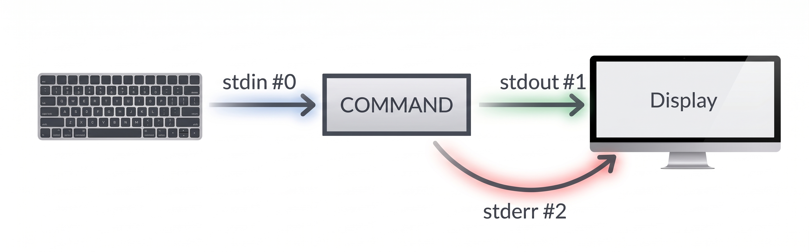

Para este módulo vamos a trabajar con el siguiente [archivo](../datasets/species_observations.xlsx) que contiene observaciones de especies vegetales en distintos sitios de muestreo.

# Ver el contenido de un archivo: `cat`, `less`, `head`, `tail`

## 'cat' y 'less'

`cat` vuelca el archivo entero en la terminal, de golpe:

```{.bash}
~$ cat species_observations.csv
sample_id,date,site,latitude,longitude,species,count,notes
S001,2024-05-12,SiteA,40.123,-3.456,Quercus_robur,3,Adultos en borde de camino
S002,2024-05-12,SiteA,40.123,-3.456,Pinus_sylvestris,5,Plantación cercana
...
```

:::{ .callout-note}
Aquí el [archivo de texto](../datasets/species_observations.csv)
:::

`less` abre el archivo en un visor paginado — puedes bajar con las flechas o `Espacio`, subir con `b`, buscar con `/`, y salir con `q` — **sin cargar nunca todo el archivo en memoria de golpe**.

```{.bash}
~$ less species_observations.csv
```

`less` tiene muchas opciones, una que suele ser útil es `-S` para que no haga *wrap* de las líneas largas (las corta y te permite desplazarte horizontalmente con las flechas).

## 'head' y 'tail'

`head` y `tail` muestran solo el principio o el final. Por defecto son 10 líneas; con `-N` eliges cuántas:

```
~$ head -4 species_observations.csv
sample_id,date,site,latitude,longitude,species,count,notes
S001,2024-05-12,SiteA,40.123,-3.456,Quercus_robur,3,Adultos en borde de camino
S002,2024-05-12,SiteA,40.123,-3.456,Pinus_sylvestris,5,Plantación cercana
S003,2024-06-01,SiteB,41.001,-3.500,Fragaria_vesca,12,Bosque claro

~$ tail -2 species_observations.csv
S004,2024-06-02,SiteC,40.900,-3.600,Arabidopsis_thaliana,30,Parcel experimental
S005,2024-06-15,SiteB,41.001,-3.500,Betula_pendula,2,Jóvenes
```

## Caracteres invisibles y codificación: `cat -A`

Un archivo de texto no es más que una secuencia de bytes que el ordenador interpreta como caracteres según una **codificación** — hoy en día, casi siempre UTF-8. La mayor parte del tiempo esto pasa desapercibido, pero dos casos se cuelan con frecuencia en datos reales: caracteres no imprimibles (tabuladores, fines de línea) y letras fuera del alfabeto inglés (acentos, eñes), que en UTF-8 ocupan más de un byte cada una.

`cat -A` muestra esos caracteres que normalmente son invisibles:

```{.bash}
~$ head -3 species_observations.csv | cat -A
sample_id,date,site,latitude,longitude,species,count,notes$
S001,2024-05-12,SiteA,40.123,-3.456,Quercus_robur,3,Adultos en borde de camino$
S002,2024-05-12,SiteA,40.123,-3.456,Pinus_sylvestris,5,PlantaciM-CM-3n cercana$
```

El `$` al final de cada línea marca el salto de línea — si vieras `^M$` en su lugar, sería la señal de un archivo editado en Windows (que termina cada línea con dos caracteres, retorno de carro + salto de línea, en vez de uno solo), un desajuste que puede hacer que `grep` o `sed` no encuentren coincidencias que a simple vista sí están ahí. Fíjate también en `PlantaciM-CM-3n`: la "ó" no es un único carácter para el ordenador, sino dos bytes (`M-C` y `M-3`) que tu terminal reinterpreta como UTF-8 y te muestra como "ó".

::: {.callout-note}
Si alguna vez `grep` o `sed` "no encuentran" algo que ves perfectamente en pantalla, sospecha de caracteres invisibles: espacios finales, tabuladores en vez de espacios, o fines de línea de Windows. `cat -A` es la primera herramienta a la que recurrir para diagnosticarlo.
:::

::: {.callout-tip title=Cuestión}
- ¿Este [archivo](../datasets/gene_info.csv) está separado por espacios o por tabuladores? ¿Y [este](../datasets/gene_expression.csv)?
:::

# Contar: `wc`

`wc` (*word count*) cuenta líneas (`-l`), palabras (`-w`) o caracteres (`-c`):

```{.bash}
~$ wc species_observations.csv
120  351  8995 species_observations.csv
```
Si solo quieres, por ejemplo, el número de líneas, añade `-l`:

```{.bash}
~$ wc -l species_observations.csv
120 species_observations.csv
```

# Extraer columnas: `cut`

`cut` extrae las columnas que indiquemos en `-f` (*fields*). Por defecto, asume que el separador de campo es el tabulador, pero esto se puede modificar con `-d` (*delimiter*).

```{.bash}
~$ cut -d',' -f3,6 species_observations.csv
site,species
SiteA,Quercus_robur
SiteA,Pinus_sylvestris
SiteB,Fragaria_vesca
SiteC,Arabidopsis_thaliana
SiteB,Betula_pendula
```

Para indicar los campos que queremos seleccionar:

- N : el campo N (p.e., cut -f 3 file1)
- N- : desde el campo N hasta el final (p.e., cut -f 3- file1)
- N-M : desde el campo N al M (p.e., cut -f 3-6 file1)
- -M : desde el primer campo al campo M (p.e., cut -f -3 file1)
- N,M : los campos indicados (p.e., cut -f 3,6,8 file1)


::: {.callout-tip title=Cuestión}
- Extrae la información de la muestra B de **gene_expression.csv**
- Extrae el código de SwissProt de **gene_info.csv**
:::


# Buscar cadenas: `grep`

`grep` busca líneas que contengan un patrón de texto. Por ejemplo, para ver solo las observaciones de `SiteA`:

```{.bash}
~$ grep 'SiteA' species_observations.csv
S001,2024-05-12,SiteA,40.123,-3.456,Quercus_robur,3,Adultos en borde de camino
S002,2024-05-12,SiteA,40.123,-3.456,Pinus_sylvestris,5,Plantación cercana
```

Ten en cuenta que `grep` busca el patrón **exacto** que has introducido. Distingue entre mayúsculas de minúsculas y no importa si es una palabra completa o parte de ella.

`grep` tiene muchas opciones; por ejemplo, puede:
- `-i` ignorar mayúsculas/minúsculas
- `-v` invertir la búsqueda (muestra las líneas que **no** contienen el patrón)
- `-n` mostrar el número de línea junto a cada coincidencia
- `-f` permite usar un archivo con varios patrones de búsqueda


# Combinando comandos: tuberías (pipelines) `|`

Las tuberías permiten encadenar comandos: la salida de uno se convierte en la entrada del siguiente. Por ejemplo, para contar cuántas observaciones hay de `SiteA`:

```{.bash}
~$ grep 'SiteA' species_observations.csv | wc -l
```

:::{ .callout-tip title=Cuestión}
- ¿Podrías contar cuántas líneas de información tiene el archivo **species_observations.csv**?
- ¿Podrías contar cuántas líneas de observaciones tiene el archivo (sin contar la cabecera)?
- ¿Cuántas observaciones son de `Plantación`? ¿y de `plantación`?
- ¿En qué tipos de ambientes aparecen exclusivamente las especies *Rumex acetosa*, *Quercus ilex*, *Quercus suber* y *Acer campestre*?
:::

# Flujos de información: entrada, salida y error estándar

Cuando ejecutas un comando se abren tres flujos (*streams*) de información:



- **Entrada estándar** (*stdin*): de donde el comando lee, normalmente el teclado.
- **Salida estándar** (*stdout*): donde el comando escribe sus resultados, normalmente la pantalla.
- **Error estándar** (*stderr*): un canal aparte donde el comando escribe sus mensajes de error — también a la pantalla por defecto, lo que hace que a simple vista *stdout* y *stderr* parezcan un único flujo.

Una tubería `|` solo conecta la salida estándar de un comando con la entrada estándar del siguiente. Los mensajes de error **no** viajan por la tubería — siguen apareciendo en pantalla aunque hayas encauzado la salida a otro sitio. Por ejemplo, si te equivocas en el nombre de un archivo:

```{.bash}
~$ grep 'SiteA' species_observations.csv archivo_inexistente.csv | wc -l
grep: archivo_inexistente.csv: No such file or directory
22
```

## Redirecciones: `>`, `>>`

Hasta ahora, la salida de tus comandos siempre iba a la pantalla, pero podemos redirigirla a un archivo en su lugar:

- `>` guarda la **salida estándar** en un archivo, **sobrescribiéndolo** si ya existe.
- `>>` añade la **salida estándar** al final del archivo, sin borrar lo que ya había.

:::{.callout-tip title="Cuestión" }
Usa el siguiente [archivo](../datasets/sequences.fasta) que almacena secuencias fasta
- Guarda en un archivo el número de secuencias
- Guarda en el mismo archivo los géneros de las especies
:::

Como los *streams* son separados podemos salvarlos de manera independiente:

- `1>` redirige la **salida estándar**
- `2>` redirige el **error estándar**
- `2>&1` redirige ambos flujos al mismo archivo

Esto suele ser muy útil cuando corres algún programa y quieres conservar los mensajes de error del programa. 

:::{.callout-tip title="Cuestión" }

- Ejecuta primero `cat archivo_falso.csv` y luego intenta capturar el error en un archivo.
- Ejecuta primero `grep 'site' archivo1.csv species_observations.csv` y luego guarda ambos flujos en archivos separados.
:::


# Ordenar: `sort`

`sort` es capaz de ordenar basado en una columna. El separador de columna que asume por defecto es el espacio en blanco pero se puede cambiar con `-t`.

La ordenación por defecto es alfabéticamente (`-n` cambia a numérica) y se realiza por la primera columna (`-k`, *keys*, permite escoger por qué columna quieres ordenar): 

```{.bash}
~$ tail -n +4 species_observations.csv | sort -t',' -k7,7 -nr
S004,2024-06-02,SiteC,40.900,-3.600,Arabidopsis_thaliana,30,Parcel experimental
S003,2024-06-01,SiteB,41.001,-3.500,Fragaria_vesca,12,Bosque claro
S002,2024-05-12,SiteA,40.123,-3.456,Pinus_sylvestris,5,Plantación cercana
S001,2024-05-12,SiteA,40.123,-3.456,Quercus_robur,3,Adultos en borde de camino
S005,2024-06-15,SiteB,41.001,-3.500,Betula_pendula,2,Jóvenes
```

# Eliminar duplicados: `uniq`

`uniq` elimina líneas duplicadas **consecutivas**. Si las líneas iguales no están juntas, `uniq` no las agrupa. Por eso casi siempre verás `sort` justo antes de `uniq` en una tubería: `sort` agrupa las líneas iguales, y entonces `uniq` puede eliminarlas. Con `-c`, además de eliminar duplicados, cuenta cuántas veces aparecía cada línea.

:::{.callout-tip title="Cuestión" }
- ¿Cuántas especies distintas has encontrado?
:::

# Editar archivos: `sed`, `nano` y `vim`

Todo lo anterior lee y transforma archivos, pero no los edita a mano. Hay dos formas de hacerlo: cambiar el contenido directamente desde la línea de órdenes con `sed`, sin abrir nada, o abrir un editor de texto que funcione dentro de la terminal — imprescindible cuando trabajas en un servidor remoto sin entorno gráfico. Los más habituales son `nano` y `vim`.

## `sed`: editar sin abrir el archivo

`sed` (*stream editor*) aplica cambios al contenido de un archivo sin necesidad de abrirlo. 

Su función más usada es `s` (*substitute*) y tiene la siguiente sintaxis `sed 's/texto_antiguo/texto_nuevo/g' archivo`. Este comando sustituye, en cada línea, todas las coincidencias de `texto_antiguo` por `texto_nuevo`. Si omitimos la opcion `g` (global),  `sed 's/texto_antiguo/texto_nuevo/' archivo` solo se sustituiría la primera coincidencia de cada línea.

::: {.callout-tip title=Cuestión}
- Modifica una errata que hay en `species_observations.csv`: la fila `S004` dice `Parcel experimental` en vez de `Parcela experimental`
:::

Por defecto `sed` **no modifica el archivo original**: imprime el resultado corregido por pantalla, y el archivo en disco sigue teniendo la errata. Para conservar el resultado, redirige la salida a un archivo nuevo.

::: {.callout-warning}
No redirijas la salida al mismo archivo de entrada (`sed '...' archivo.csv > archivo.csv`): `sed` lee el archivo a la vez que intentas sobrescribirlo, y acabas con un archivo vacío. Si de verdad quieres modificar el archivo original, algunas versiones de `sed` aceptan la opción `-i` (*in-place*) — pero úsala con cuidado, porque no pide confirmación ni se puede deshacer.
:::


::: {.callout-tip title=Cuestión}
- Convierte los tabuladores (el tabulador se codifica como `\t`) de `gene_info.csv` en `;`.
- Sobre ese resultado, convierte ahora los `;` en espacios.
- Intenta extraer la columna `description`.
:::


## `nano`

`nano` es el más sencillo: al abrirlo, escribes directamente, como en cualquier editor de texto normal. Las órdenes disponibles se muestran en la parte inferior de la pantalla, con `^` representando la tecla `Ctrl`:

```{.bash}
~$ nano informe.txt
```

Las más importantes son `Ctrl+O` (*write Out*, guardar — confirma el nombre de archivo con `Enter`) y `Ctrl+X` (salir). Si has hecho cambios y sales sin guardar, `nano` te preguntará si quieres guardarlos antes de cerrar.

## `vim`

`vim` (o `vi`) es mucho más potente, pero funciona de forma distinta a lo que esperarías: es un editor **modal**. Al abrirlo, estás en **modo normal**, donde las teclas son órdenes (moverte, borrar, copiar...) en vez de texto — si escribes ahí, no aparece texto, ¡suceden cosas raras! Para escribir, primero hay que entrar en **modo inserción**:

```{.bash}
~$ vim informe.txt
```

- `i` entra en modo inserción (ahora sí, escribes texto normal).
- `Esc` vuelve al modo normal.
- `:wq` seguido de `Enter`, **en modo normal**, guarda y sale (*write* + *quit*).
- `:q!` seguido de `Enter` sale sin guardar los cambios.

::: {.callout-tip}
Quedarse "atrapado" en `vim` sin saber cómo salir es casi un rito de iniciación en Unix. Si te pasa: pulsa `Esc` (para asegurarte de que estás en modo normal) y luego escribe `:q!` seguido de `Enter`.
:::

# Ejercicios

1. Muestra las 3 primeras filas de `species_observations.csv` (sin contar la cabecera), y las 2 últimas.
2. Cuenta cuántas observaciones (sin contar la cabecera) hay en `species_observations.csv`.
3. Extrae solo las columnas `site` y `species` de `species_observations.csv`.
4. Ordena las observaciones de `species_observations.csv` por especie.
5. Divide `species_observations.csv` en dos archivos: uno con `sample_id` y `site`, otro con `species` y `count`.
6. ¿Cuántas localidades diferentes se han muestreado? ¿Cuántas veces aparece cada una?
7. Corrige el archivo para que se ajuste al número de sitios y guárdalo corregido.
8. Abre `informe.txt` con `nano`, escribe una línea de texto cualquiera, guárdala y sal. Vuelve a abrirlo con `vim`, añade una segunda línea (recuerda entrar en modo inserción con `i` y volver a modo normal con `Esc` antes de guardar).
9. Descomprime [muestras_fastq.zip](../datasets/muestras_fastq.zip) que contiene varios archivos `.fastq`. ¿Cuántas secuencias hay en cada fichero? Une todos los archivos en uno solo. ¿Cuantas secuencias hay en total? (para descomprimir puedes hacerlo sobre el .zip con el botón derecho del ratón o bien ejecuta `unzip muestras_fastq.zip` en la terminal)
10. Disponemos de un [fichero](../datasets/tomate.sam) con el resultado de un mapeo en formato SAM ¿Cuántas secuencias se han mapeado? ¿Cuántas se han mapeado en dirección reversa (mirad la segunda columna: 0 forward; 16 reverse)? ¿Cuántos y cuáles son los unigenes a los que se ha podido mapear alguna secuencia? Ordena los nombres de secuencias mapeadas con el orden del unigene y la posición en el unigene.
